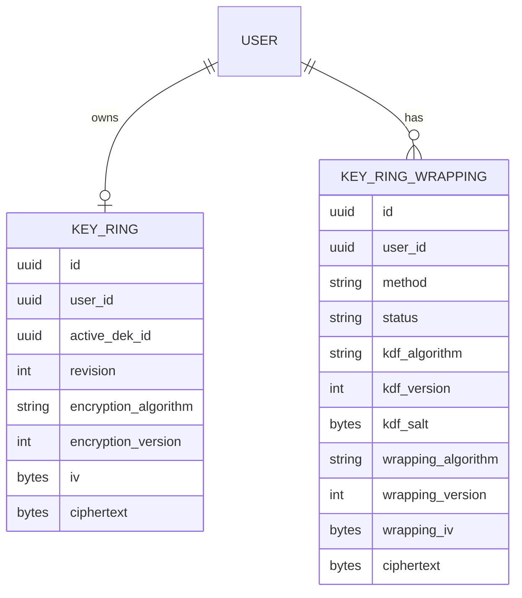
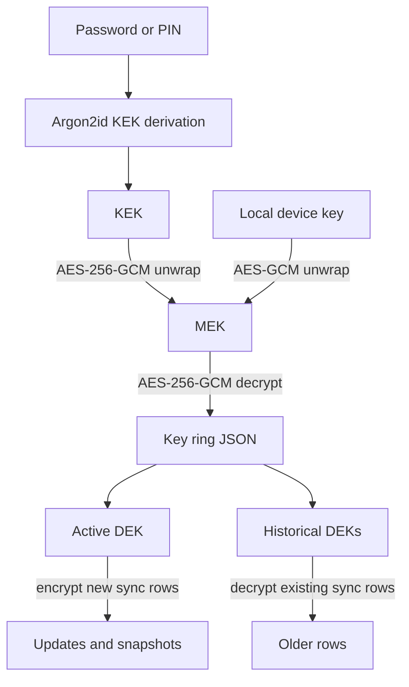
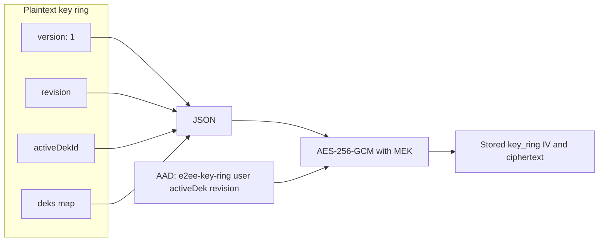
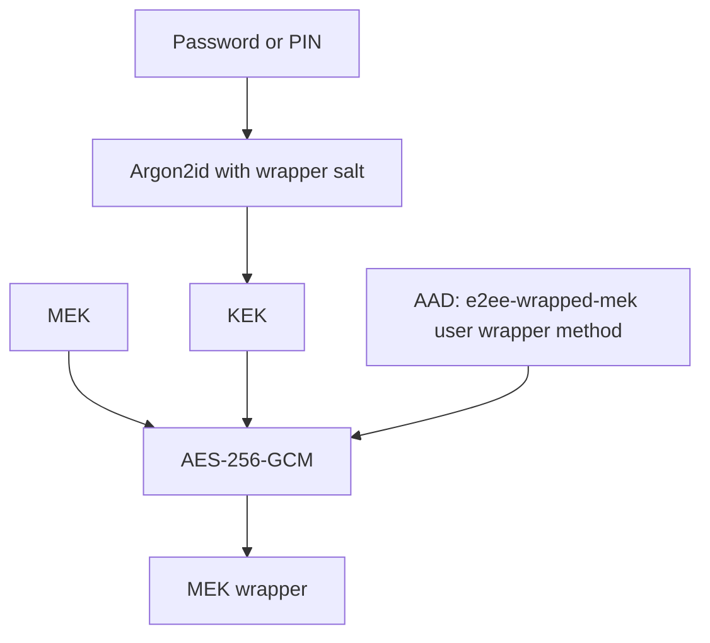
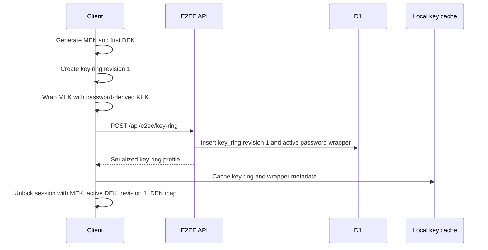
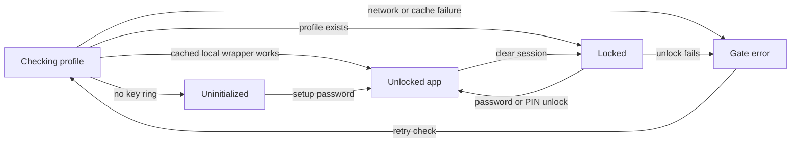
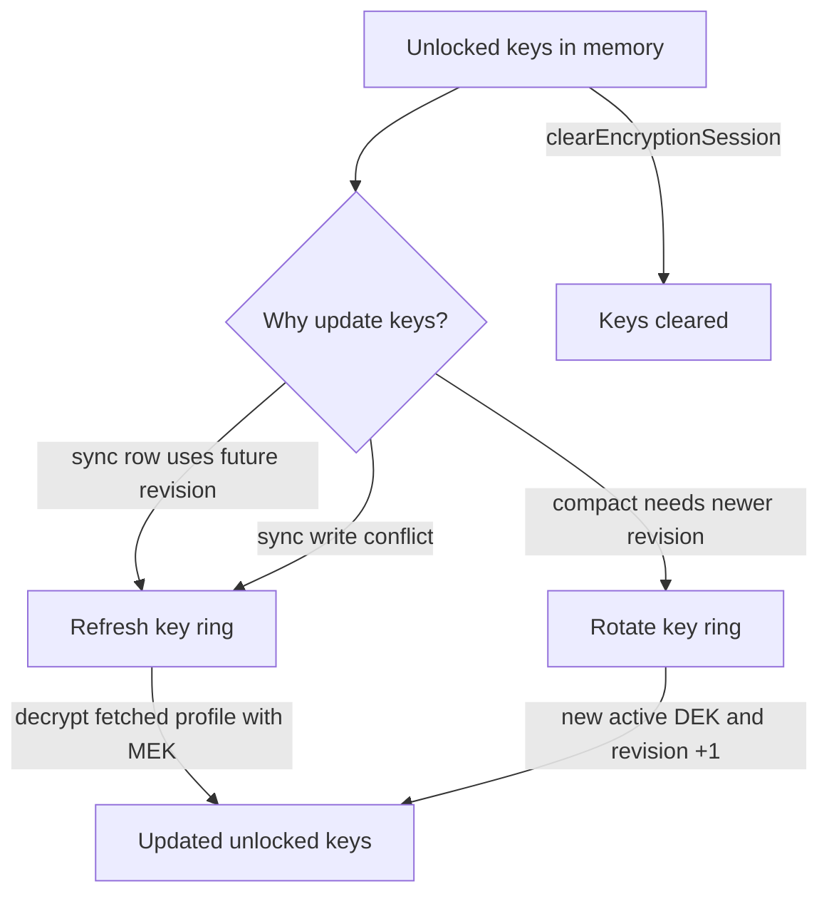
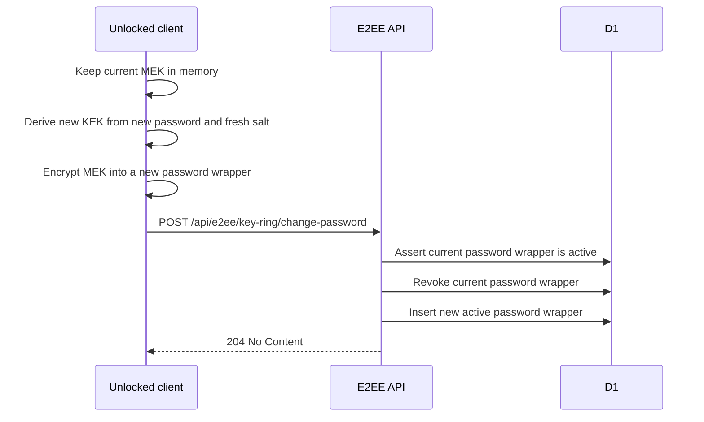

# End-to-end encryption

This document describes AutoKPO's E2EE key hierarchy, key-ring lifecycle, unlock/session behavior, DEK rotation, and password changes.

Sync-specific transport rules live in [`sync.md`](./sync.md). Sync rows use the DEKs described here, but sync sequencing, cursors, compaction, and idempotency are documented separately.

## Glossary

- **MEK**: master encryption key. Random 32-byte key that encrypts the key ring.
- **DEK**: data encryption key. Random 32-byte key used to encrypt sync updates and snapshots.
- **Active DEK**: current DEK used for new sync writes.
- **Historical DEKs**: older DEKs kept in the key ring so old sync rows remain decryptable.
- **Key ring**: encrypted JSON containing `revision`, `activeDekId`, and all DEKs.
- **Key-ring revision**: monotonic integer. It changes when a new active DEK is added.
- **KEK**: key-encryption key derived from a password or PIN and used only to wrap/unwrap the MEK.
- **Wrapper**: encrypted MEK record. Password wrappers are server-side; local-device/PIN wrappers are local.

## Storage model



Rules:

1. The server stores encrypted key-ring bytes and encrypted MEK wrappers only.
2. The server never receives plaintext MEK or DEKs.
3. The active password wrapper is the account recovery/unlock path stored server-side.
4. Local wrappers can unlock the same MEK without asking for the password, but they do not replace the password wrapper.

## Key hierarchy



Rules:

1. Password/PIN secrets derive KEKs. KEKs wrap the MEK; they do not encrypt sync data directly.
2. The MEK decrypts the key ring.
3. DEKs encrypt sync rows. See [`sync.md`](./sync.md#sync-row-encryption) for row AAD and sync metadata binding.
4. Rotation adds a DEK and changes the active DEK, but keeps historical DEKs.

## Key-ring envelope



AAD:

```text
autokpo:e2ee-key-ring:v1:${userId}:${activeDekId}:${revision}
```

Rules:

1. Key-ring plaintext must match database metadata: same revision and same active DEK id.
2. `deks` must contain the active DEK id.
3. Every decoded DEK must be 32 bytes.
4. Any mismatch is an unlock/decrypt failure.

## MEK wrapper envelope



AAD:

```text
autokpo:e2ee-wrapped-mek:v1:${userId}:${wrapperId}:${method}
```

Rules:

1. Wrappers encrypt the MEK, not DEKs.
2. Wrapper method is part of AAD, so ciphertext cannot be moved between password/PIN/local-device methods.
3. Password and PIN wrappers use Argon2id parameters recorded with the wrapper.
4. Local device key wrappers are stored locally and are device-specific.

## Initial setup



Rules:

1. Setup creates exactly one initial DEK and key-ring revision `1`.
2. Setup fails with `encryption_key_already_exists` if a profile already exists.
3. The unlocked session starts immediately after successful setup.

## Unlock and session lifecycle



Unlocked session exposes:

- `mek`
- `activeDek`
- `activeDekId`
- `keyRingRevision`
- full `deks` map
- `getDek(dekId)`
- `refreshKeyRingProfile()`
- `updateKeyRingProfile()`

Rules:

1. Unlock decrypts the MEK first, then decrypts the key ring with the MEK.
2. The DEK map is kept only in unlocked React state.
3. `clearEncryptionSession` clears MEK, active DEK, revision, and DEK map from React state.
4. Remote sync cannot run without an unlocked encryption context.

## Refreshing and rotating key material



Rules:

1. Refresh fetches the latest key-ring profile, caches it, decrypts it with the current MEK, and updates unlocked DEK state.
2. Rotation creates a new DEK, appends it to the DEK map, makes it active, and increments revision by one.
3. Rotation submits an optimistic `PUT /api/e2ee/key-ring` guarded by `currentRevision`.
4. If another device wins the revision race, the client refreshes and may use the winner's key ring when it satisfies the caller's revision requirements.

Recovery errors are handled outside the happy-path graph:

- **Refresh fails**: network, profile decrypt, or still-stale revision errors stop the current sync attempt. The Y.Doc is preserved.
- **Rotation conflict**: refresh the key ring and use the winner only when its revision is newer than the compact basis.
- **Rotation fallback is not newer**: fail compaction instead of writing a snapshot with stale key material.

## Change password

Password change rewraps the same MEK. It does not rotate DEKs and does not change key-ring revision.



Rules:

1. Change password requires an unlocked MEK.
2. The MEK remains the same, so all existing key-ring and sync data remains decryptable.
3. Only the password wrapper changes.
4. The previous password wrapper is revoked atomically with inserting the new wrapper.
5. If the current wrapper is already revoked or missing, the server returns `password_wrapper_conflict`.

## Invariants

- Server never receives plaintext MEK or DEKs.
- Key ring keeps historical DEKs across rotation.
- Key-ring AAD binds user id, active DEK id, and revision.
- MEK wrapper AAD binds user id, wrapper id, and method.
- Password change does not rotate DEKs or change key-ring revision.
- Clear session removes all plaintext key material from React state.
