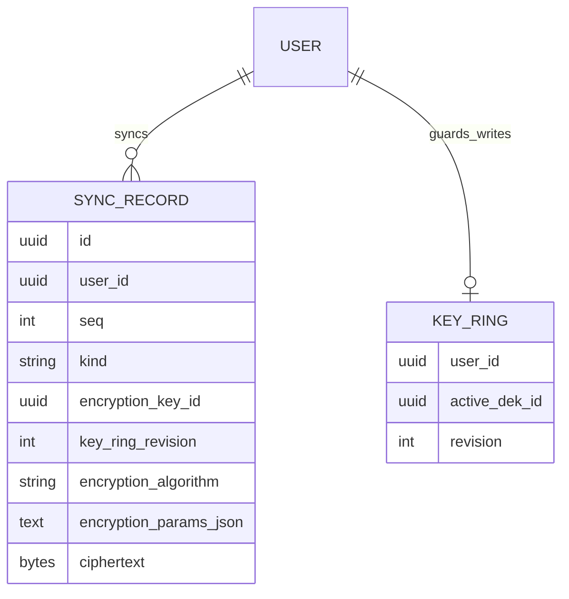
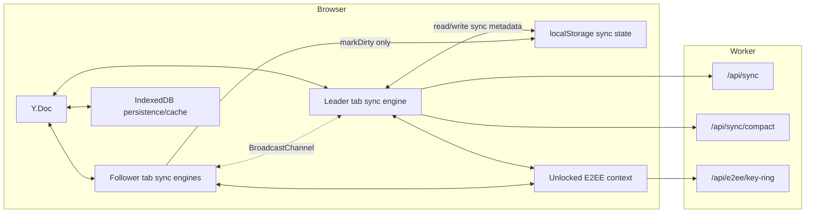
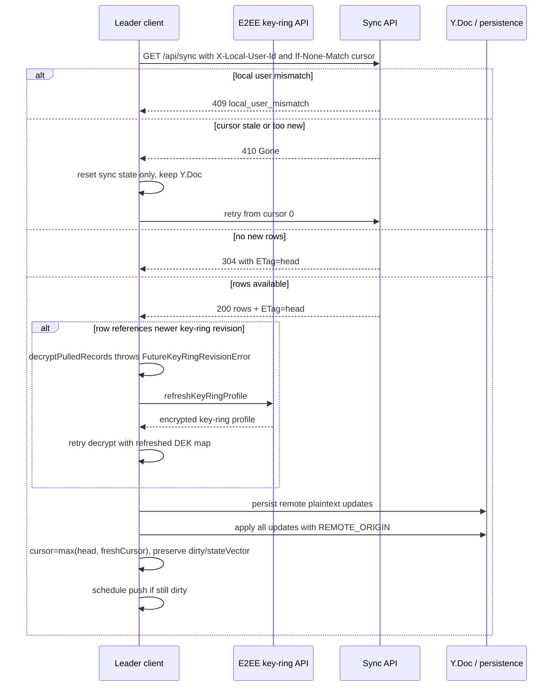
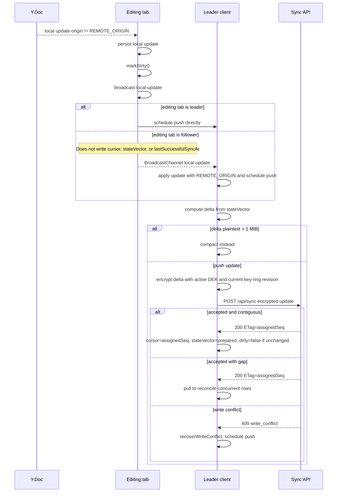
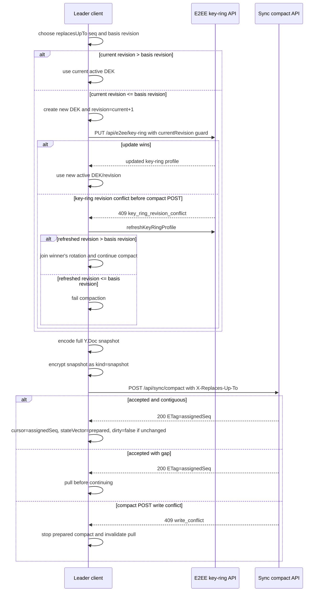
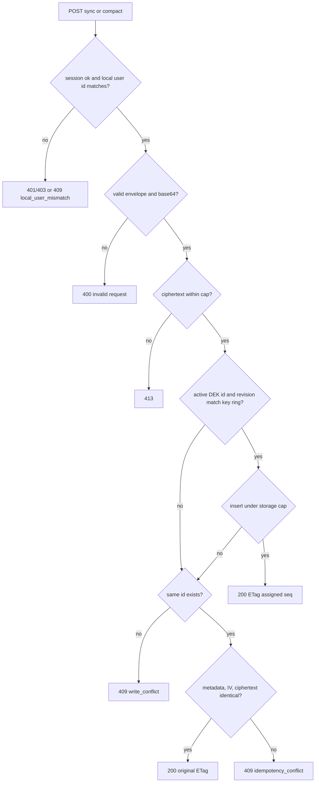
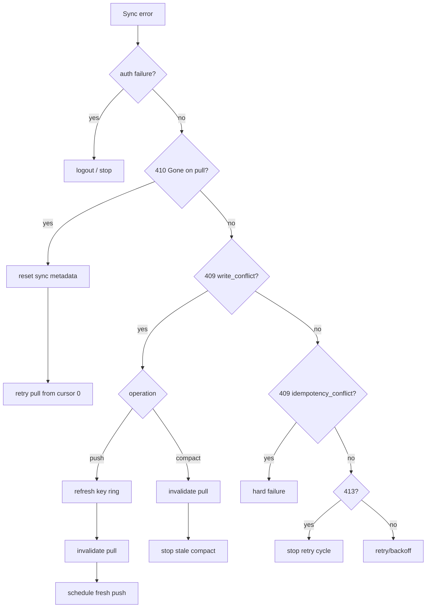

# Encrypted sync

This document describes AutoKPO's local-first Yjs sync protocol, cursor rules, encryption metadata on sync rows, push/pull/compact behavior, and sync error handling.

E2EE key hierarchy, key-ring rotation, wrappers, unlock, and password changes are documented in [`e2ee.md`](./e2ee.md). This sync protocol depends on an unlocked E2EE session for DEK lookup and encryption.

## Glossary

- **Y.Doc**: local CRDT document containing application data.
- **Sync state**: localStorage side-channel metadata: `cursor`, `stateVector`, `dirty`, and `lastSuccessfulSyncAt`.
- **Leader tab**: the only tab that talks to sync HTTP APIs.
- **Follower tab**: a tab that writes local persistence and asks the leader to sync.
- **Update row**: encrypted Yjs delta (`kind = update`).
- **Snapshot row**: encrypted full Y.Doc state (`kind = snapshot`) created by compaction.
- **DEK / key-ring revision**: encryption material from [`e2ee.md`](./e2ee.md).

## Storage model



Rules:

1. Every sync row stores the DEK id and key-ring revision used to encrypt it.
2. Server-side sync writes are accepted only when `(userId, activeDekId, revision)` matches the current key ring.
3. The server stores encrypted bytes only; plaintext Yjs updates/snapshots never leave the browser.
4. Sync metadata is not stored in the Y.Doc.

## Sync row encryption

Sync rows use DEKs from the unlocked E2EE key ring. See [`e2ee.md`](./e2ee.md#key-hierarchy) for key ownership and rotation rules.

Each sync row uses:

- algorithm: `aes-256-gcm`
- encryption params: `{ iv: 12 random bytes (base64), tagBits: 128 }`
- ciphertext: encrypted Yjs delta/snapshot plus GCM tag
- AAD:

```text
autokpo:e2ee-update:v1:${userId}:${encryptionKeyId}:${keyRingRevision}:${blockId}:${kind}
```

Rules:

1. Decrypt pulled rows with the row's `encryptionKeyId`, not blindly with the active DEK.
2. AAD binds ciphertext to user, DEK id, key-ring revision, row id, and row kind.
3. Changing `kind`, `id`, `encryptionKeyId`, `keyRingRevision`, user, IV, or ciphertext invalidates authentication.
4. Unsupported encryption algorithm is a hard error.

## Browser actors



Rules:

1. Only the leader tab performs HTTP pull, push, and compact.
2. Every tab may write encrypted IndexedDB persistence for local Yjs updates.
3. Follower tabs only call `syncState.markDirty()` for localStorage sync state; they do not write cursor, state vector, or last-success metadata.
4. Followers send `local-update` and `request-sync` messages to the leader over `BroadcastChannel`.
5. Remote and bus-applied updates use `REMOTE_ORIGIN`, so they do not echo back into local dirty tracking.

## Pull flow



Rules:

1. Pull uses the cursor as `If-None-Match`; server returns current head as `ETag`.
2. `304` means the cursor is already at head.
3. `410` means local sync metadata is invalid. Reset sync metadata and retry from scratch; do not wipe the Y.Doc.
4. `decryptPulledRecords` throws `FutureKeyRingRevisionError` when rows reference a newer key-ring revision; the pull path refreshes the key ring once and retries decryption.
5. If rows still reference a future revision after refresh, fail hard.
6. Pull advances `cursor` but preserves local `dirty` and `stateVector` because pull does not acknowledge local edits.

## Push flow



Rules:

1. Push happens only when `stateVector === null` or `dirty === true`.
2. Every local edit, leader or follower, persists the update and calls `markDirty()`.
3. Followers do not advance cursor/state-vector metadata; they only mark dirty and notify the leader.
4. Delta is computed from the last acknowledged state vector.
5. After `410` recovery, `stateVector` is null, so push sends full document state.
6. New update rows are encrypted with current active DEK and key-ring revision.
7. A push is contiguous only when `assignedSeq - 1 === cursor`.
8. If another local/follower update arrives while a push is in flight, the push ack advances `stateVector` only to the prepared payload and keeps `dirty=true`, then schedules another push.
9. Non-contiguous push means another device appended rows first; pull before trying again.
10. `write_conflict` means active DEK/revision changed; recover by refreshing E2EE key material and invalidating pull before retrying.

## Compaction flow

Compaction replaces many update rows with a full encrypted snapshot. Before compacting, the client captures the current key-ring revision as the **basis revision**. The snapshot must use a key-ring revision newer than that basis.



Rules:

1. Compact when a delta exceeds the client update limit or server returns `X-Compact-Hint: please`.
2. Snapshot plaintext is the full encoded Y.Doc state.
3. Snapshot rows use `kind = snapshot`; kind is included in AAD.
4. Rotation adds a new DEK, makes it active, increments revision by one, and keeps previous DEKs.
5. The client does not pre-fetch the key ring before attempting rotation; it uses the unlocked key-ring state and relies on the `currentRevision` guard. If another device wins that rotation race, refresh the key ring, join the winner's newer revision, and continue preparing the compact snapshot.
6. Compact uses the state vector captured with the prepared snapshot. If another local/follower update arrives while compaction is in flight, compact keeps `dirty=true` and schedules another push; otherwise it can clear `dirty`.
7. A `409 write_conflict` from `POST /api/sync/compact` means the prepared snapshot is stale. End the current compact attempt and invalidate pull. Do not refresh keys or retry the same snapshot in that compact flow; after pull, a later push cycle decides whether compaction is still needed.

## Server write and idempotency rules



Rules:

1. Sync row ids are idempotency keys.
2. Retrying the exact same encrypted request with the same id returns the original sequence.
3. Reusing an id with different metadata, IV, or ciphertext returns `idempotency_conflict`.
4. If the id is new but active DEK/revision guard fails, return `write_conflict`.
5. Server assigns dense monotonic `seq` values per user.
6. Server hard storage cap is 4 MiB of ciphertext per user.
7. Server asks for compaction at 200 rows or 2 MiB by returning `X-Compact-Hint: please`.
8. Compact keeps a tail bounded by 50 rows or 256 KiB, so recently stale clients can often catch up without immediate `410`.

## Error handling summary



Rules:

1. `SyncGoneError` is the special retry path for stale cursors.
2. Push write-conflict recovery refreshes E2EE key material, invalidates pull, and schedules a new push because the delta must be recomputed.
3. Compact write-conflict recovery only invalidates pull and stops the prepared compact attempt.
4. Compact does not retry the same prepared payload after write conflict; after pull, a later push cycle decides whether compaction is still needed.
5. Auth/local-user mismatch logs out or stops the current sync attempt.

## Invariants

- Every sync write includes `encryptionKeyId` and `keyRingRevision`.
- New sync writes use only the active DEK from the current key-ring revision.
- Pull decrypts each row with the row's own DEK id.
- `REMOTE_ORIGIN` is used for remote/bus-applied Yjs updates.
- `410` resets sync metadata only, never the Y.Doc.
- Followers only call `markDirty()` for localStorage sync metadata.
- Only the leader writes cursor/state-vector/last-success metadata.
- Server never receives plaintext Yjs updates or snapshots.
